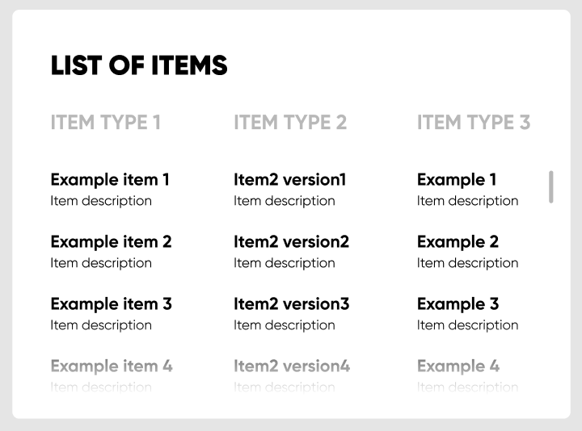

# React Scrollfade

React Scrollfade is a React component designed to dynamically fade out the bottom of a scrollable element based on the scrollbars position.



## Installation

You can install the library using npm:

```
npm install @benestudioco/react-scrollfade
```

## How to use it

It works with zero configuration needed. Just include it as a direct child of the scrollable element.
The fade makes the bottom of the element transparent, so the color of the fade is determined by what is under it.

```jsx
import React from 'react';
import ScrollFade from '@benestudioco/react-scrollfade';

export const Example = () => (
    <div
        style={{
            width: 200,
            height: 100,
            overflowY: 'auto',
            background: 'red',
        }}
    >
        <ScrollFade />
        Dolor amet eu occaecat excepteur do adipisicing cillum duis. Est ullamco ullamco sit ea irure consequat id do ex
        enim consectetur nisi duis elit. Qui mollit magna exercitation est sit.
    </div>
);
```

### Custom Height

You can also set a different height for the fade

```jsx
import React from 'react';
import ScrollFade from '@benestudioco/react-scrollfade';

export const ExampleWithCustomHeight = () => (
    <div
        style={{
            width: 200,
            height: 100,
            overflowY: 'auto',
            background: 'red',
        }}
    >
        <ScrollFade height={30} />
        Dolor amet eu occaecat excepteur do adipisicing cillum duis. Est ullamco ullamco sit ea irure consequat id do ex
        enim consectetur nisi duis elit. Qui mollit magna exercitation est sit.
    </div>
);
```

### Browser Support

The component utilizes CSS masks and -webkit-masks as a fallbak.
See browser compatibilities here: https://caniuse.com/?search=mask

### Examples

There are interactive examples.

`npm run examples` starts an instance where you can look at them.

## Contribution

We welcome contributions in the form of pull requests.
The examples also serve as a development server.

If you have any issues, questions or suggestions please open a new Issue.
